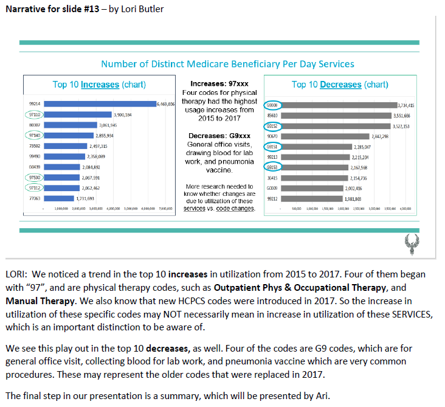

# Healthcare Bluebook - Team Phoenix

#### Team project in my Data Analytics class at Nasvhille Software School. 
#### Team Phoenix Members
- Jack McCann (leader)
- Diego Alvarez 
- Nicole Muldowney
- Teresa Whitesell
- Ari Khursheed
- Lori Butler

## Project Scope
Healthcare Bluebook "HCBB" (https://www.healthcarebluebook.com/) provides cost comparison information about health care procedures to consumers to help them gind the most cost effective way for treatments. 

Two executives from HCBB presented background information to our class, provided several large sets of data, and asked **three sets of questions**. Our team tackled the **second set of questions**:  
1. Which procedures (HCPCS codes) had the largest change in average payment between 2015 and 2017?  
2. Which codes had the largest change in utilization?

 Those seemed like simple enough questions until diving into the very messy data!

## Approach
As a team we took the following steps. 
1. Combined the 2015 and 2017 data by concatenating the DataFrames. This was a better choice than merging because there were changes to the medicial billing codes ("HCPCS", called "hicks-picks", codes) in 2017.
2. We then performed EDA for a couple days
3. We then prepared a dashboard in Tableau... Deigo Alvares and Nicole Muldowny took the lead creating teh Tableau dashbaord.
4. Teresa Whitesell and I worked on creating horizontal bar graphs for the four top 10 lists, and researched a few trends we noticed to add to the narrative.

## Challenges
- 30 million rows of very messy data! 
    - Changes in HCPCS codes in 2017 caused many null values to be created when we compared 2015 to 2017. We handled those by dropping them. Another option would have been to put in a zero, or another fill number (such as a mean or median), but in this case that would have skewed the results.
- 6,700+ HCPCS billing codes
- We also needed to create a new column with three new values for Doctor Only, Facility Only, and Doctor & Facility based on four combinations of Provider Type (Individual or Organization), and Place of Serivce (Office or Facility).
- Creating the calcution for the difference between 2015 and 2017 was difficult in Python. We experimented at length with melting vs pivoting. We finally exported tables to Tableau to complete the calcuation.

## My role
- Participated in doing EDA. Each team member performed EDA simultaneously, in our own notebooks, with a lot of live coding/code sharing along the way. 
- Towards the end we split up into different groups.
    - Two team members - Nicole Muldowny and Diego Alvarez - drove the development of two Tableau dashboards (one each for differences in amount, and differences in utilization)
    - Teresa, Ari and I worked on a alternate method of trying to do the calculation in Python, per a method suggested by our instructor, but we ran into issues with duplicated data that we couldn't resolve in the available time.
- I chose the background design theme for the Google Slide show, using HCBB's hex code colors (which Nicole had reserached)
- Teresa and I reasearched some trends we saw in the top 10 / bottom 10 lists of changes in amounts and changes in utilization, and added story-telling points to the presentation.
-  Here is the final set of charts that I contributed to the presentation, and the speaking notes:  

## Data Sources

### **OUR DATA SOURCE:** 
#### Physician & Other Supplier Payments (detailed data)

https://www.cms.gov/Research-Statistics-Data-and-Systems/Statistics-Trends-and-Reports/Medicare-Provider-Charge-Data/Physician-and-Other-Supplier2017   
  
    

### **OTHER DATA SOURCES**, used by other teams to answer different data questions:
#### Hospital Outpatient - Detail Data
https://www.cms.gov/Research-Statistics-Data-and-Systems/Statistics-Trends-and-Reports/Medicare-Provider-Charge-Data/Outpatient

#### APC to CPT/HCPCS crosswalk... Addendum B – January 2020 (correction files aren't necessary)
https://www.cms.gov/Medicare/Medicare-Fee-for-Service-Payment/HospitalOutpatientPPS/Addendum-A-and-Addendum-B-Updates

#### Zip Code to CBSA
https://www.huduser.gov/portal/datasets/usps_crosswalk.html

#### Other  
Data.CMS.gov
